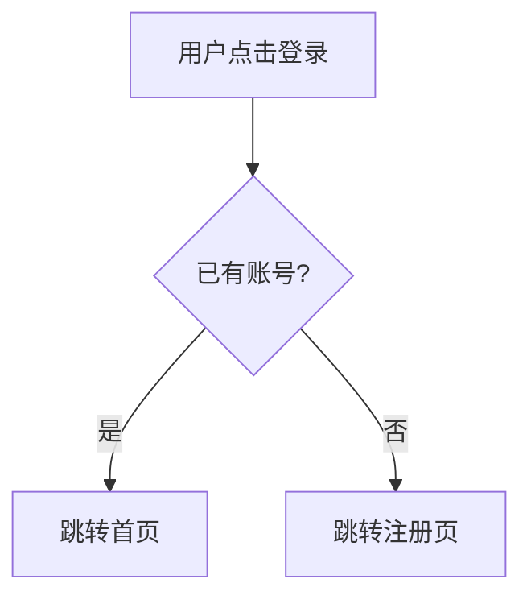

# mermaid-diagram-skill

A Claude Code skill that converts natural language or requirement documents into Mermaid diagrams, saved as `.md` files for developers and product managers.

## What It Does

- Accepts **natural language descriptions** or **existing PRD/requirement files** as input
- Automatically selects the right diagram type based on your description
- Saves the output as a `.md` file to `docs/diagrams/`

## Diagram Types

| Use Case | Diagram Type |
|----------|-------------|
| Page navigation, user flows | `flowchart TD` |
| Business logic, decision branches | `flowchart LR` |
| API calls, system interactions | `sequenceDiagram` |
| Module relationships, architecture | `graph TD` |

## Usage

```
/mermaid-diagram 用户点击登录，有账号跳首页，没有去注册页
```

Or from a file:

```
/mermaid-diagram 读取 docs/prd.md，画出用户注册流程
```

Output is saved to `docs/diagrams/YYYY-MM-DD-<topic>.md`.

## Installation

Copy `SKILL.md` to your Claude Code skills directory:

```
~/.claude/skills/mermaid-diagram/SKILL.md
```

## Example Output


